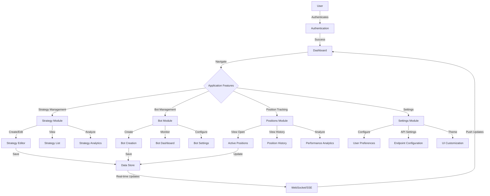
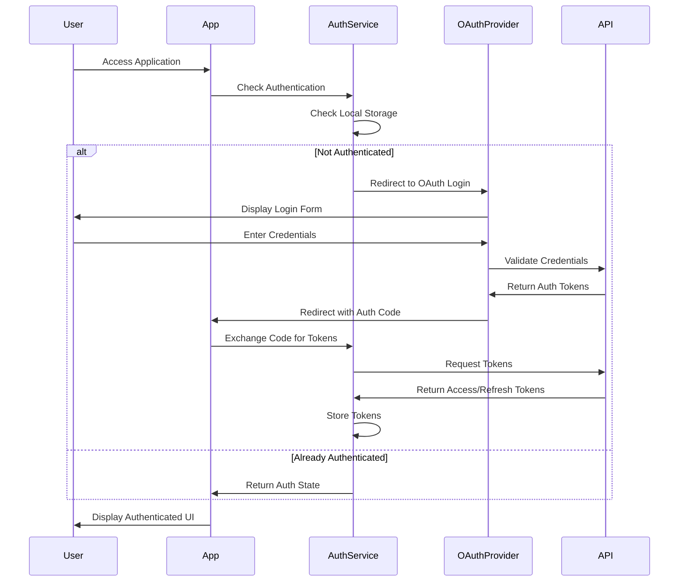
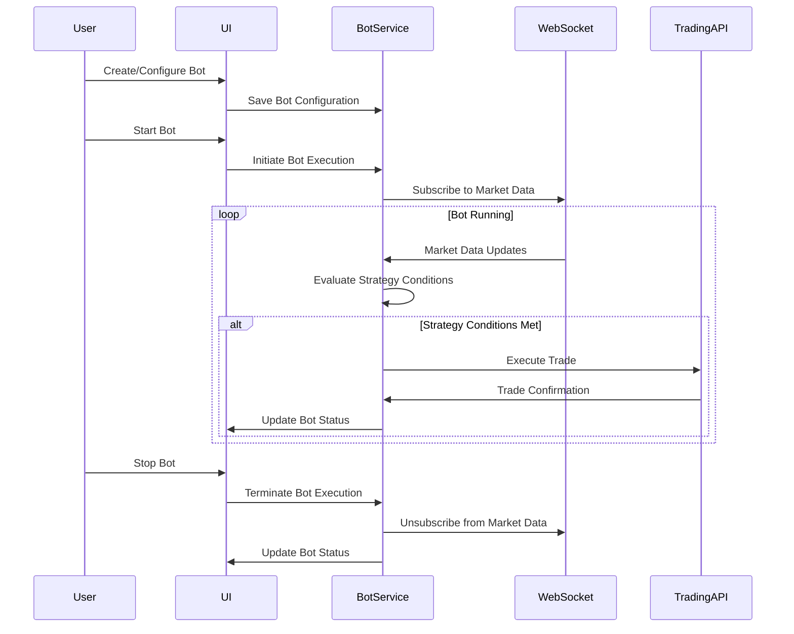
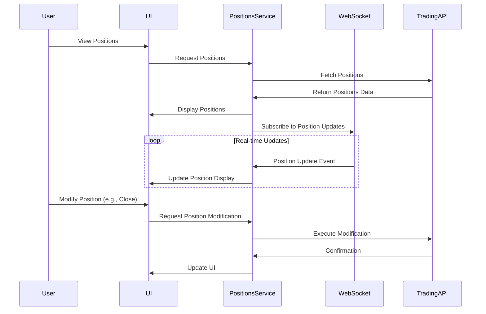
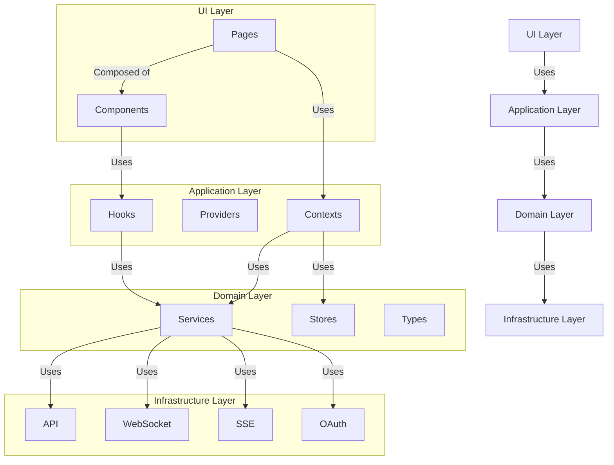
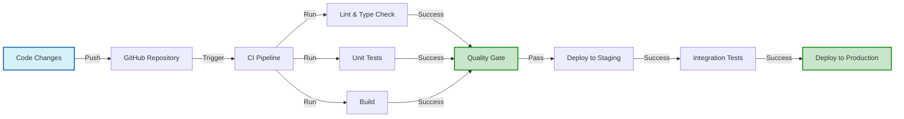

# Champion Trading Automation

A professional-grade trading automation platform built with React, TypeScript, and modern web technologies. This platform enables traders to create, manage, and execute sophisticated trading strategies with real-time market data integration across cryptocurrency and forex markets.

<div align="center">
  
</div>

## 📊 Application Overview

Champion Trading Automation is designed for both novice and professional traders who want to automate their trading strategies. The platform provides a comprehensive suite of tools for strategy creation, bot management, position tracking, and market analysis with a focus on user experience and performance.

### 🚀 Key Features

#### Strategy Management
- **Strategy Creation**: Intuitive interface for building trading strategies
- **Strategy Testing**: Backtest strategies against historical data
- **Strategy Templates**: Pre-built strategies for common trading patterns
- **Strategy Sharing**: Export and import strategies between accounts

#### Bot Automation
- **Bot Creation**: Convert strategies into automated trading bots
- **Bot Monitoring**: Real-time monitoring of bot performance
- **Parameter Optimization**: Fine-tune bot parameters for optimal results
- **Execution Controls**: Start, stop, and pause bots with safety limits

#### Position Management
- **Position Tracking**: Real-time monitoring of all trading positions
- **Performance Analytics**: Detailed metrics on trading performance
- **Risk Management**: Tools for managing risk across positions
- **Trade History**: Comprehensive history of all executed trades

#### Market Analysis
- **Market Data**: Real-time price and volume data
- **Technical Indicators**: Common technical analysis indicators
- **Market Insights**: AI-powered market trend analysis
- **Multi-Market Support**: Trade across cryptocurrency and forex markets

### 💻 Technical Features
- Real-time WebSocket data streaming for market updates
- Server-Sent Events (SSE) for system notifications
- OAuth2 authentication with secure token management
- Responsive design optimized for desktop and mobile
- Dark/Light theme support with customizable UI
- Singleton-based auth store for consistent authentication state
- Error boundary implementation for graceful error handling

## 🔄 Application Flow Diagram



## 🔄 Core Process Flows

### Authentication Process



### Trading Bot Execution Flow



### Position Management Flow



## 🛠 Technology Stack

### Frontend Core
- **React 18**: UI library with hooks and functional components
- **TypeScript 5**: Strongly-typed programming language
- **Vite**: Modern build tool for fast development and optimized production builds

### UI and Styling
- **Ant Design 5**: Enterprise-grade UI component library
- **SCSS Modules**: Scoped styling with BEM methodology
- **CSS Variables**: For theming and consistent design tokens

### State Management
- **React Context API**: For shared state management
- **Custom Hooks**: For encapsulating and reusing stateful logic
- **Singleton Stores**: For global state accessible outside React components

### Network and Communication
- **Axios**: HTTP client for API requests
- **WebSocket API**: For real-time bidirectional communication
- **Server-Sent Events (SSE)**: For server-to-client real-time updates

### Development and Quality
- **ESLint + Prettier**: Code quality and formatting
- **Jest + React Testing Library**: Testing framework
- **Git Hooks**: Pre-commit validation and quality checks
- **TypeScript**: Static type checking

## 📁 Project Architecture

The application follows a domain-driven, feature-based architecture with clear separation of concerns:

### Directory Structure

```
champion-trading-automation/
├── src/                    # Source code
│   ├── assets/             # Static assets (images, icons)
│   ├── components/         # Reusable UI components
│   │   ├── AccountHeader/  # User account information
│   │   ├── Bots/          # Bot management components
│   │   ├── Positions/     # Position tracking components
│   │   └── ...            # Other component directories
│   ├── config/            # Application configuration
│   ├── contexts/          # React context providers
│   │   ├── AuthContext.tsx
│   │   ├── ThemeContext.tsx
│   │   └── ...
│   ├── hooks/             # Custom React hooks
│   │   ├── useSSE.ts
│   │   ├── useWebSocket.ts
│   │   └── ...
│   ├── pages/             # Top-level page components
│   │   ├── BotsPage.tsx
│   │   ├── PositionsPage.tsx
│   │   └── ...
│   ├── providers/         # Provider components
│   ├── router/            # Routing configuration
│   ├── services/          # API and external services
│   │   ├── api/          # REST API services
│   │   ├── oauth/        # Authentication services
│   │   ├── sse/          # Server-Sent Events
│   │   ├── trade/        # Trading services
│   │   └── websocket/    # WebSocket services
│   ├── stores/           # Singleton stores for global state
│   ├── styles/           # Global styles and theming
│   └── types/            # TypeScript type definitions
├── public/               # Static public assets
├── scripts/              # Build and utility scripts
└── docs/                 # Documentation
```

### Architectural Layers



## 🔧 Setup and Installation

### Prerequisites
- Node.js (v18 or higher)
- npm (v8 or higher)
- Git

### Installation Steps

1. Clone the repository:
```bash
git clone https://github.com/your-username/champion-trading-automation.git
cd champion-trading-automation
```

2. Install dependencies:
```bash
npm install
```
This will automatically set up Git hooks including the pre-commit hook that verifies successful builds.

3. Configure environment variables:
```bash
cp .env.example .env
```

Edit `.env` with your configuration:
```env
# API Configuration
VITE_OAUTH_APP_ID=your_app_id
VITE_OAUTH_URL=https://your-oauth-server.com/oauth2/authorize
VITE_PLATFORM_NAME=champion-automation
VITE_BRAND_NAME=your_brand

# WebSocket Configuration
VITE_WS_URL=wss://your-ws-server.com/websockets/v3
VITE_Auth_Url=https://your-auth-server.com/websockets/authorize
VITE_Deriv_Url=wss://your-deriv-server.com/websockets/v3
```

4. Start development server:
```bash
npm run dev
```

5. Build for production:
```bash
npm run build
```

## 💻 Development Guidelines

### Component Architecture

The application follows a component-based architecture with several patterns:

#### Component Hierarchy

```
Pages
├── Container Components (connected to state)
│   ├── Feature Components (domain-specific)
│   │   ├── UI Components (presentational)
│   │   └── Shared Components (reusable)
```

#### Component Structure

Each component is encapsulated in its own directory:

```
ComponentName/
├── index.tsx          # Component implementation
├── styles.scss        # Component-specific styles
├── README.md          # Component documentation (optional)
└── components/        # Sub-components (optional)
    └── SubComponent/
```

### State Management Architecture

The application uses a layered state management approach:

#### State Management Layers

1. **Component State**: Local state using `useState` and `useReducer`
2. **Shared State**: React Context for state shared across components
3. **Global State**: Store modules for application-wide state
4. **Persistent State**: Local storage for state that persists across sessions

### Authentication Architecture

The application uses a centralized authentication system with three main components:

1. **AuthContext**: React Context for component-level auth state management
2. **AuthStore**: Singleton store for global auth state, accessible by services
3. **Local Storage**: Persistent storage for auth data

Key auth data is stored in:
- `app_auth`: Contains authorize response (loginId, token, userId)
- `app_params`: Contains OAuth parameters

Services access auth data through AuthStore instead of directly accessing environment variables or localStorage.

### Real-time Communication Architecture

The application implements a sophisticated real-time communication system:

#### WebSocket Communication

- **Connection Management**: Automatic connection establishment and reconnection
- **Message Handling**: Type-safe message parsing and handling
- **Subscription Model**: Topic-based subscription for targeted updates

#### Server-Sent Events (SSE)

- **Event Streaming**: Continuous event stream from server to client
- **Event Filtering**: Client-side filtering of relevant events
- **Reconnection Logic**: Automatic reconnection with exponential backoff

### Git Hooks

#### Pre-commit Hook
This project uses a pre-commit hook to ensure code quality by verifying successful builds before allowing commits:

- **Functionality**: Automatically runs `npm run build` before each commit
- **Error Handling**: Prevents commits if the build fails and displays helpful error messages
- **Bypass Options**:
  - For emergency situations: `git commit --no-verify`
  - Using environment variable: `SKIP_BUILD_CHECK=1 git commit`
- **Testing the Hook**: Run `npm run test:pre-commit` to test the pre-commit hook without making a commit

### Code Style and Best Practices

#### TypeScript
- Use strict mode for all TypeScript files
- Define interfaces for all props, state, and function parameters
- Use type guards for runtime type checking
- Leverage generics for reusable components and functions

#### React
- Use functional components with hooks
- Implement proper error boundaries
- Memoize expensive calculations and component renders
- Use React.memo for pure components

#### Styling
- Use SCSS modules for component-specific styles
- Follow BEM methodology for class naming
- Utilize CSS variables for theming
- Maintain responsive design principles

#### Error Handling
- Use try/catch blocks for async operations
- Implement error boundaries for component errors
- Log errors with contextual information
- Provide user-friendly error messages

## 🚀 Deployment

### Production Build
1. Update environment variables for production
2. Build the application:
```bash
npm run build
```
3. Test the production build:
```bash
npm run preview
```

### Deployment Options

#### Vercel (Recommended)
```bash
npm install -g vercel
vercel login
vercel
```

#### Firebase Hosting
```bash
npm install -g firebase-tools
firebase login
firebase init
firebase deploy
```

#### Docker Deployment
```bash
docker build -t champion-trading-automation .
docker run -p 8080:80 champion-trading-automation
```

## 🔄 CI/CD Pipeline



## 📝 Documentation

### Component Documentation

Each component should be documented with:
- Purpose and functionality
- Props interface with descriptions
- Usage examples
- Edge cases and error handling

### API Documentation

API services are documented with:
- Endpoint descriptions
- Request and response types
- Error handling
- Authentication requirements

### Additional Documentation

- [API Documentation](./src/services/README.md)
- [Component Library](./src/components/README.md)
- [State Management](./src/contexts/README.md)
- [Custom Hooks](./src/hooks/README.md)
- [Pages & Routes](./src/pages/README.md)
- [Type Definitions](./src/types/README.md)
- [Styling Guide](./src/styles/README.md)
- [Git Hooks](./docs/git-hooks.md)

## 🤝 Contributing

### Contribution Process

1. Fork the repository
2. Create a feature branch (`git checkout -b feature/amazing-feature`)
3. Make your changes
4. Run tests and ensure they pass
5. Commit your changes (`git commit -m 'Add some amazing feature'`)
6. Push to the branch (`git push origin feature/amazing-feature`)
7. Open a Pull Request

### Pull Request Guidelines

- Include a clear description of the changes
- Link to any related issues
- Include screenshots for UI changes
- Ensure all tests pass
- Request review from at least one team member

## 📈 Performance Optimization

### Optimization Techniques

- Code splitting and lazy loading
- Memoization of expensive calculations
- Virtualization for long lists
- Asset optimization (images, fonts)
- Service worker for caching
