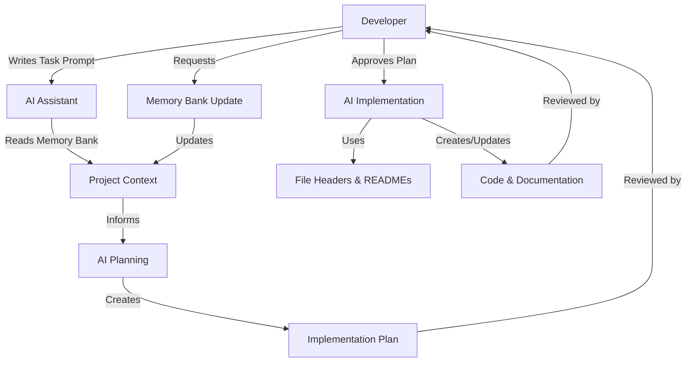
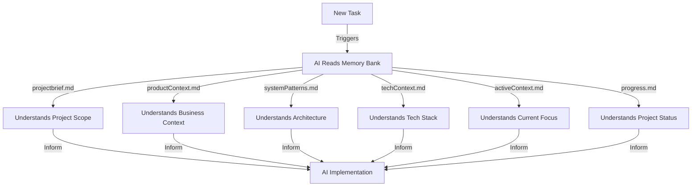
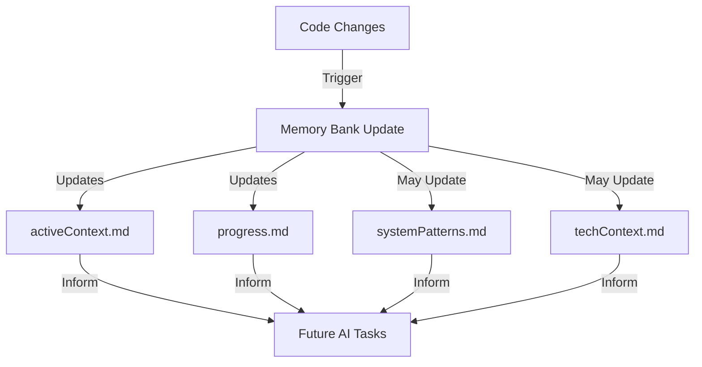

# AI Development Workflow

This document illustrates the AI development workflow within the Champion Trading Automation project, covering how developers interact with AI tools (like Cline/RooCode) and how the AI processes and implements solutions using the project's documentation structure.

## Introduction

The Champion Trading Automation project leverages AI-assisted development to enhance productivity, maintain code quality, and ensure consistent documentation. This workflow combines developer expertise with AI capabilities, using a structured approach to documentation that enables the AI to maintain context and deliver high-quality solutions.

Key components of this workflow include:
- Custom AI prompt with memory bank integration
- Memory bank documentation structure
- File header comments for AI context
- Functional code comments
- Folder-structure README files
- Project intelligence through .clinerules

## AI Development Workflow Overview



This workflow creates a continuous feedback loop where the AI maintains and leverages project documentation to deliver solutions that align with project standards and patterns.

## Initial Project Setup

### Developer Actions
1. **Create Memory Bank Structure**
   - Create the memory-bank directory
   - Initialize core files (projectbrief.md, productContext.md, etc.)
   - Document project scope, architecture, and technical context

2. **Define Project Intelligence**
   - Create .clinerules file with project-specific patterns
   - Document development approach and standards
   - Establish documentation requirements

3. **Set Up File Structure**
   - Organize project with clear folder structure
   - Create README files for key directories
   - Implement initial file header templates

### AI Processes
1. **Memory Bank Initialization**
   - Reads all memory bank files to understand project context
   - Maps relationships between components and features
   - Identifies architectural patterns and technical constraints

2. **Project Pattern Recognition**
   - Analyzes .clinerules to understand project standards
   - Identifies coding patterns and preferences
   - Maps folder structure and component organization

## Task Initiation Workflow

### Developer Actions
1. **Write Task Prompt**
   - Describe the task or feature to implement
   - Provide any specific requirements or constraints
   - Reference relevant existing components or patterns

2. **Provide Additional Context**
   - Share any external resources or references
   - Clarify business requirements
   - Specify performance or technical constraints

### AI Processes
1. **Memory Bank Reading**
   - Automatically reads all memory bank files at task start
   - Prioritizes activeContext.md and progress.md for current state
   - Cross-references with systemPatterns.md and techContext.md

2. **Context Building**
   - Maps task requirements to existing architecture
   - Identifies related components and dependencies
   - Determines applicable patterns and standards



## Planning Phase

### Developer Actions
1. **Review Implementation Plan**
   - Evaluate the AI's proposed approach
   - Verify alignment with project goals
   - Check for technical feasibility

2. **Provide Feedback**
   - Suggest adjustments to the approach
   - Clarify any misunderstandings
   - Add additional constraints or requirements

3. **Approve Plan**
   - Confirm the implementation plan
   - Authorize AI to proceed with implementation
   - Switch AI to implementation mode if needed

### AI Processes
1. **Solution Design**
   - Creates implementation plan based on memory bank context
   - Follows architectural patterns from systemPatterns.md
   - Adheres to technical constraints from techContext.md

2. **Plan Documentation**
   - Creates diagrams to illustrate the approach
   - Documents implementation steps
   - Identifies potential challenges or edge cases

3. **Mode Switching**
   - Transitions from planning to implementation mode
   - Maintains context across mode switch
   - Prepares for code generation or modification

## Implementation Phase

### Developer Actions
1. **Monitor Implementation**
   - Review code changes as they're made
   - Provide feedback on implementation details
   - Answer any follow-up questions

2. **Test Solutions**
   - Verify that implemented solutions work as expected
   - Test edge cases and error handling
   - Validate performance and usability

### AI Processes
1. **File Header Utilization**
   - Reads file headers to understand component purposes
   - Identifies dependencies and relationships
   - Follows established patterns and architectures

2. **README Interpretation**
   - Uses folder README files to understand organization
   - Follows folder-specific conventions
   - Maintains consistent structure

3. **Code Implementation**
   - Generates or modifies code following project patterns
   - Adds appropriate comments and documentation
   - Ensures type safety and error handling

```mermaid
flowchart TD
    A[AI Implementation] -->|Reads| B[File Headers]
    B -->|@description| C[Understands Purpose]
    B -->|@components| D[Identifies Key Elements]
    B -->|@dependencies| E[Maps Relationships]
    B -->|@architecture| F[Follows Patterns]
    B -->|@ai-hints| G[Gets Special Context]
    C & D & E & F & G -->|Guide| H[Code Changes]
```

## Documentation Update Workflow

### Developer Actions
1. **Request Memory Bank Updates**
   - Trigger updates with "update memory bank" command
   - Review proposed documentation changes
   - Approve or modify documentation updates

2. **Maintain File Headers**
   - Ensure new files have appropriate headers
   - Update headers when component functionality changes
   - Add AI-specific hints for complex components

### AI Processes
1. **Memory Bank Updating**
   - Reviews all memory bank files
   - Updates activeContext.md with current focus
   - Updates progress.md with implementation status
   - May update other files as needed

2. **Documentation Generation**
   - Creates or updates file headers
   - Updates README files
   - Ensures documentation consistency



## Continuous Improvement Cycle

### Developer Actions
1. **Provide Feedback on AI Patterns**
   - Identify successful AI approaches
   - Note areas for improvement
   - Suggest new patterns or techniques

2. **Update Project Intelligence**
   - Add new patterns to .clinerules
   - Document evolving project decisions
   - Capture learned best practices

### AI Processes
1. **Pattern Learning**
   - Identifies recurring patterns in feedback
   - Adapts approach based on .clinerules updates
   - Improves implementation quality over time

2. **Knowledge Application**
   - Applies learned patterns to new tasks
   - Maintains consistency with established patterns
   - Suggests improvements based on past experiences

## Example Workflows

### Feature Implementation Example

**Developer Prompt:**
"Implement a new strategy card component that displays trading strategy details and allows users to activate/deactivate the strategy."

**AI Process:**
1. Reads memory bank to understand component architecture and UI patterns
2. Examines existing card components (e.g., BotCard) for patterns
3. Creates implementation plan following project architecture
4. After approval, implements component with appropriate file structure:
   - Component directory with index.tsx and styles.scss
   - File header with component documentation
   - Consistent styling following project patterns
5. Updates memory bank to document the new component

### Bug Fix Example

**Developer Prompt:**
"Fix the WebSocket reconnection issue where messages are lost during reconnection."

**AI Process:**
1. Reads memory bank to understand current WebSocket implementation
2. Examines activeContext.md to find known issues
3. Reviews systemPatterns.md for error handling patterns
4. Analyzes relevant code files using file headers for guidance
5. Implements solution with message queuing and replay mechanism
6. Updates progress.md to reflect the fixed issue

### Refactoring Example

**Developer Prompt:**
"Refactor the balance stream service to use the new unified SSE streaming component."

**AI Process:**
1. Reads unified-sse-streaming-component-plan.md for implementation details
2. Examines existing balance stream service implementation
3. Creates adapter to maintain backward compatibility
4. Implements refactoring following the adapter pattern from systemPatterns.md
5. Updates file headers to document the new implementation
6. Updates memory bank to reflect the architectural change

## Best Practices

### For Developers

1. **Writing Effective Prompts**
   - Be specific about requirements and constraints
   - Reference existing components or patterns when relevant
   - Provide business context for features

2. **Maintaining Documentation Quality**
   - Keep memory bank files up to date
   - Ensure file headers are accurate and comprehensive
   - Update .clinerules with new patterns and preferences

3. **Providing Useful Feedback**
   - Be specific about what works and what needs improvement
   - Explain the reasoning behind feedback
   - Document recurring patterns in .clinerules

### For AI Usage

1. **Leveraging Documentation Effectively**
   - Always read all memory bank files at task start
   - Use file headers to understand component purposes
   - Follow patterns documented in .clinerules

2. **Following Project Patterns**
   - Maintain consistent code style and architecture
   - Use established patterns for error handling and state management
   - Follow folder structure and file organization conventions

3. **Maintaining Documentation Consistency**
   - Update memory bank after significant changes
   - Create comprehensive file headers for new files
   - Ensure README files reflect current structure

## Conclusion

The AI development workflow in the Champion Trading Automation project creates a symbiotic relationship between developers and AI. By maintaining comprehensive documentation through the memory bank, file headers, and README files, the AI can deliver high-quality solutions that align with project standards and patterns. This workflow enhances productivity while ensuring consistency and maintainability across the codebase.