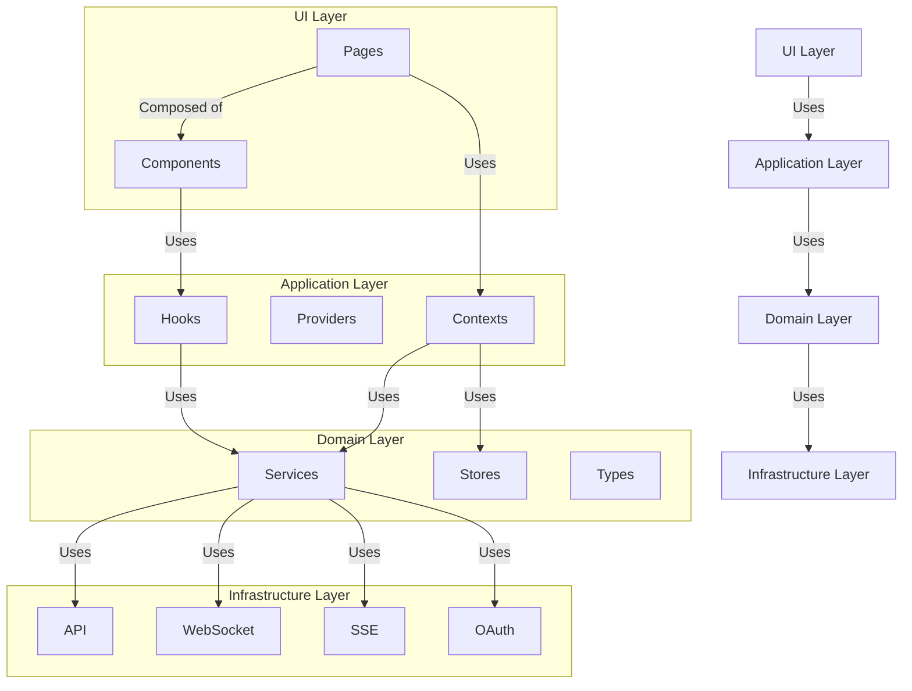
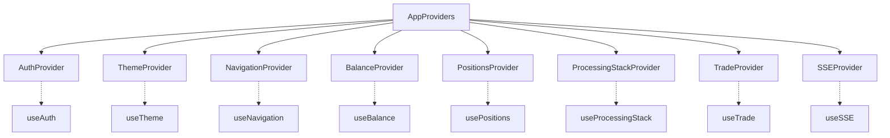
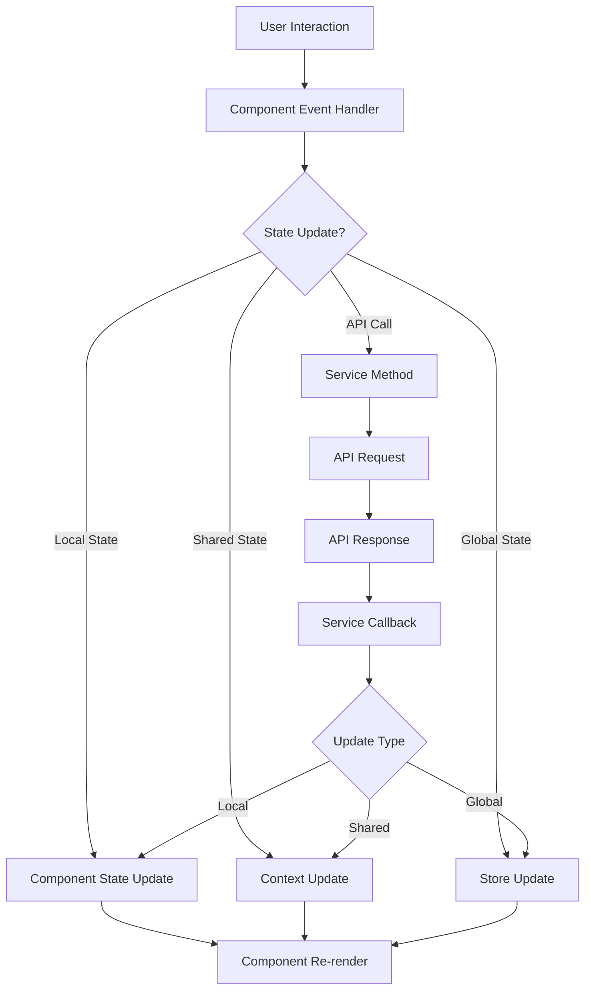
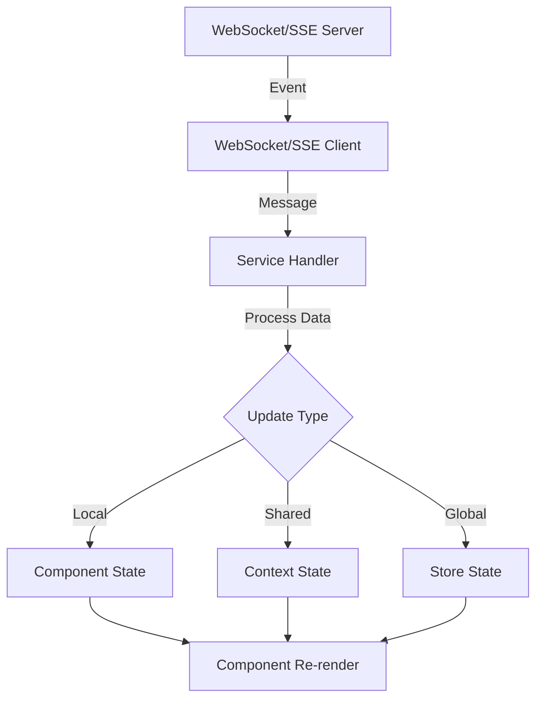
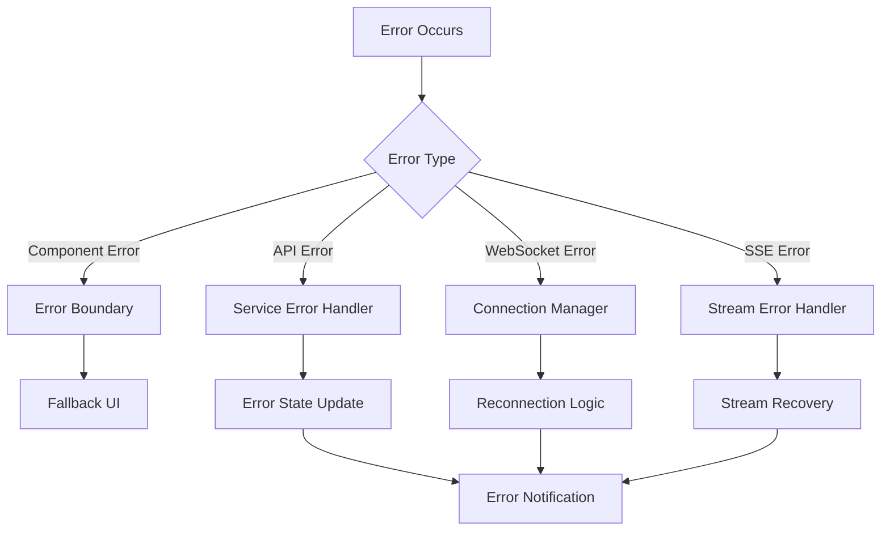

# System Patterns: Champion Trading Automation

## Overall Architecture

Champion Trading Automation follows a domain-driven, feature-based architecture with clear separation of concerns. The application is structured in architectural layers that promote maintainability, testability, and scalability.



### Architectural Layers

1. **UI Layer**
   - Responsible for rendering the user interface
   - Contains pages and components
   - Focuses on presentation logic and user interactions
   - Consumes data and functionality from the Application Layer

2. **Application Layer**
   - Manages application state and business logic
   - Contains contexts, providers, and hooks
   - Orchestrates interactions between UI and Domain layers
   - Handles cross-cutting concerns like authentication and theming

3. **Domain Layer**
   - Implements core business logic and rules
   - Contains services, stores, and type definitions
   - Encapsulates domain-specific operations and validations
   - Maintains business invariants and constraints

4. **Infrastructure Layer**
   - Handles external communication and data access
   - Contains API clients, WebSocket connections, SSE handlers, and OAuth integration
   - Abstracts external dependencies from the rest of the application
   - Manages technical concerns like connection handling and retry logic

## Key Technical Decisions

### Component-Based Architecture
The application uses a component-based architecture with React, emphasizing reusability, composability, and encapsulation. Components are organized in a hierarchical structure, with clear separation between container components (connected to state) and presentational components.

### State Management Approach
The application employs a layered state management approach:

1. **Component State**: Local state using `useState` and `useReducer` for component-specific concerns
2. **Shared State**: React Context for state shared across components within a feature
3. **Global State**: Singleton stores for application-wide state accessible outside React components
4. **Persistent State**: Local storage for state that persists across sessions

### Authentication Architecture
The application uses a centralized authentication system with three main components:

1. **AuthContext**: React Context for component-level auth state management
2. **AuthStore**: Singleton store for global auth state, accessible by services
3. **Local Storage**: Persistent storage for auth data

Key auth data is stored in:
- `app_auth`: Contains authorize response (loginId, token, userId)
- `app_params`: Contains OAuth parameters

Services access auth data through AuthStore instead of directly accessing environment variables or localStorage.

### Real-time Communication Architecture
The application implements a sophisticated real-time communication system:

#### WebSocket Communication
- **Connection Management**: Automatic connection establishment and reconnection
- **Message Handling**: Type-safe message parsing and handling
- **Subscription Model**: Topic-based subscription for targeted updates

#### Server-Sent Events (SSE)
- **Event Streaming**: Continuous event stream from server to client
- **Event Filtering**: Client-side filtering of relevant events
- **Reconnection Logic**: Automatic reconnection with exponential backoff

### Error Handling Strategy
The application implements a comprehensive error handling strategy:

1. **Error Boundaries**: React error boundaries to catch and handle component errors
2. **Service-Level Error Handling**: Try/catch blocks in async operations with standardized error responses
3. **Global Error Handling**: Centralized error logging and notification system
4. **User Feedback**: Clear error messages and recovery options for users

## Design Patterns in Use

### Singleton Pattern
Used for global stores that need to be accessed from anywhere in the application, such as the AuthStore. This ensures a single source of truth for critical application state.

```typescript
// Example of Singleton Pattern in authStore.ts
export class AuthStore {
  private static instance: AuthStore;
  private authState: AuthState = { isAuthenticated: false };

  private constructor() {}

  public static getInstance(): AuthStore {
    if (!AuthStore.instance) {
      AuthStore.instance = new AuthStore();
    }
    return AuthStore.instance;
  }

  // Methods to get and update auth state
}

export const authStore = AuthStore.getInstance();
```

### Provider Pattern
Used extensively with React Context to provide state and functionality to component trees without prop drilling.

```typescript
// Example of Provider Pattern in AuthContext.tsx
export const AuthContext = createContext<AuthContextType | undefined>(undefined);

export const AuthProvider: React.FC<PropsWithChildren<{}>> = ({ children }) => {
  const [authState, setAuthState] = useState<AuthState>({ isAuthenticated: false });
  
  // Authentication logic and methods
  
  return (
    <AuthContext.Provider value={{ authState, login, logout }}>
      {children}
    </AuthContext.Provider>
  );
};
```

### Observer Pattern
Implemented in the WebSocket and SSE services to notify subscribers of real-time updates.

```typescript
// Example of Observer Pattern in WebSocket service
export class WebSocketService {
  private subscribers = new Map<string, Set<Function>>();
  
  subscribe(topic: string, callback: Function): void {
    if (!this.subscribers.has(topic)) {
      this.subscribers.set(topic, new Set());
    }
    this.subscribers.get(topic)?.add(callback);
  }
  
  unsubscribe(topic: string, callback: Function): void {
    this.subscribers.get(topic)?.delete(callback);
  }
  
  notify(topic: string, data: any): void {
    this.subscribers.get(topic)?.forEach(callback => callback(data));
  }
}
```

### Adapter Pattern
Used to provide consistent interfaces for different data sources or APIs.

```typescript
// Example of Adapter Pattern for different market data sources
interface MarketDataAdapter {
  getPrice(symbol: string): Promise<number>;
  getVolume(symbol: string): Promise<number>;
}

class CryptoMarketAdapter implements MarketDataAdapter {
  // Implementation for crypto markets
}

class ForexMarketAdapter implements MarketDataAdapter {
  // Implementation for forex markets
}
```

### Factory Pattern
Used to create instances of services or components based on configuration or runtime conditions.

```typescript
// Example of Factory Pattern for stream services
class StreamFactory {
  static createStreamService(type: StreamType): BaseStreamService {
    switch (type) {
      case StreamType.EVENT_SOURCE:
        return new EventSourceStreamService();
      case StreamType.FETCH:
        return new FetchStreamService();
      default:
        throw new Error(`Unknown stream type: ${type}`);
    }
  }
}
```

### Custom Hook Pattern
Used extensively to encapsulate and reuse stateful logic across components.

```typescript
// Example of Custom Hook Pattern
function useWebSocket(url: string, options?: WebSocketOptions) {
  const [data, setData] = useState<any>(null);
  const [error, setError] = useState<Error | null>(null);
  const [isConnected, setIsConnected] = useState<boolean>(false);
  
  // WebSocket connection and message handling logic
  
  return { data, error, isConnected, send };
}
```

## Component Relationships

### Component Hierarchy

```
Pages
├── Container Components (connected to state)
│   ├── Feature Components (domain-specific)
│   │   ├── UI Components (presentational)
│   │   └── Shared Components (reusable)
```

### Component Structure

Each component is encapsulated in its own directory:

```
ComponentName/
├── index.tsx          # Component implementation
├── styles.scss        # Component-specific styles
├── README.md          # Component documentation (optional)
└── components/        # Sub-components (optional)
    └── SubComponent/
```

### Key Component Relationships

1. **App → Router → Pages**
   - App provides global providers and configuration
   - Router handles navigation and route protection
   - Pages represent top-level views of the application

2. **Pages → Container Components**
   - Pages compose container components
   - Container components connect to application state
   - Container components handle data fetching and processing

3. **Container Components → Feature Components**
   - Container components compose feature components
   - Feature components implement domain-specific functionality
   - Feature components manage their own local state

4. **Feature Components → UI Components**
   - Feature components compose UI components
   - UI components are purely presentational
   - UI components receive data and callbacks via props

### Context Provider Relationships



## Communication Patterns

### Data Flow



### Real-time Data Flow



## Error Handling Patterns



## Conclusion

The Champion Trading Automation application follows a well-structured architecture with clear separation of concerns and established design patterns. The component-based approach with React, combined with the layered state management strategy, provides a flexible and maintainable foundation for the application. The real-time communication architecture enables responsive and reliable data streaming, which is critical for a trading platform.