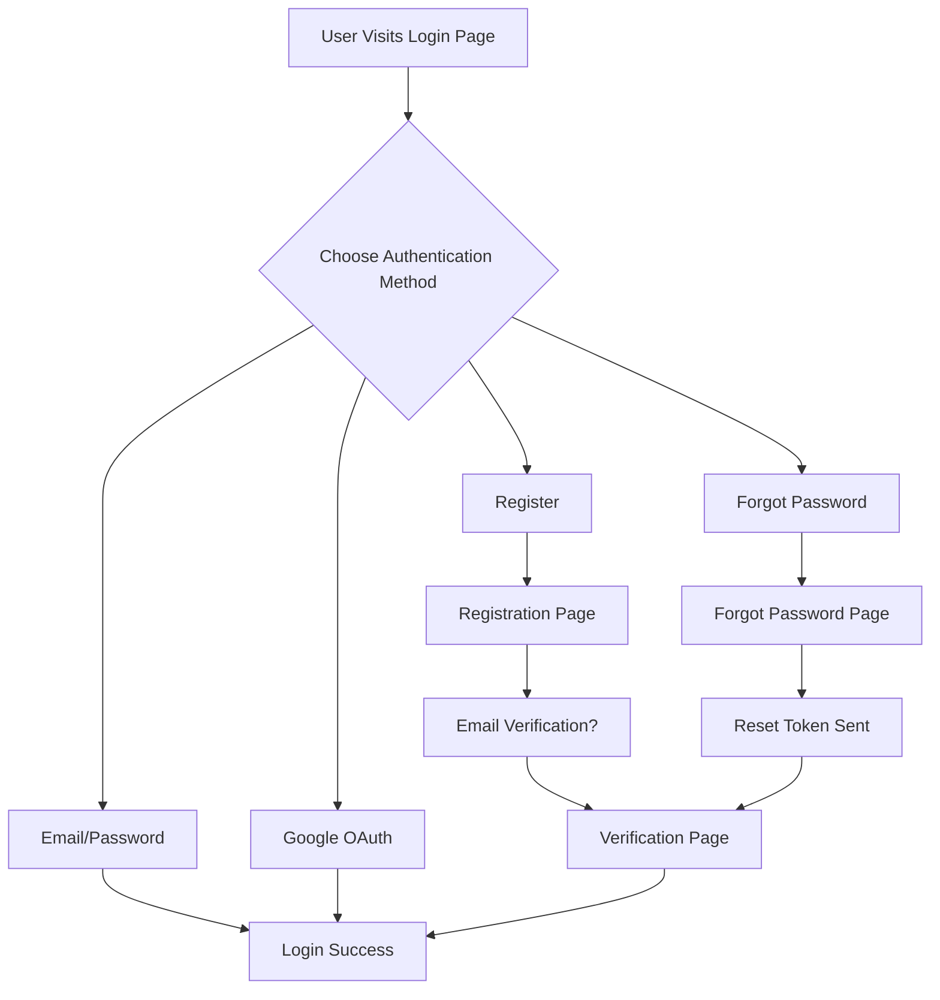

# Phone Authentication Removal Summary

## ✅ **Completed Changes**

### **Phone Authentication Components Removed**

Successfully removed all phone number sign-in functionality from the LoginPage.

### 🔧 **Components Removed**

#### **1. Phone-Related State Management**
```tsx
// REMOVED:
const [phoneLoading, setPhoneLoading] = useState(false);
const [phoneError, setPhoneError] = useState<string | null>(null);
const [showFirebaseUI, setShowFirebaseUI] = useState(false);
const [firebaseUIVisible, setFirebaseUIVisible] = useState(false);
```

#### **2. Phone Authentication Handlers**
```tsx
// REMOVED:
const handlePhoneLogin = async () => { ... };
const handleCancelPhoneAuth = () => { ... };
const handleFirebaseUIModalOpen = () => { ... };
const handleFirebaseUIModalClose = () => { ... };
```

#### **3. Phone Authentication UI Components**
```tsx
// REMOVED:
<Button onClick={handlePhoneLogin} icon={<PhoneOutlined />}>
  Continue with Phone
</Button>

// REMOVED:
<Modal title="📱 Phone Authentication" open={showFirebaseUI}>
  <div id="firebaseui-auth-container"></div>
</Modal>
```

#### **4. FirebaseUI Integration**
```tsx
// REMOVED:
import * as firebaseui from 'firebaseui';
import 'firebaseui/dist/firebaseui.css';

// REMOVED FirebaseUI configuration and initialization
```

#### **5. Phone-Related Imports**
```tsx
// REMOVED:
import { PhoneOutlined } from "@ant-design/icons";
```

### 🔄 **Updated LoginPage Structure**

#### **Before Removal:**
```tsx
// State Management
const [phoneLoading, setPhoneLoading] = useState(false);
const [phoneError, setPhoneError] = useState<string | null>(null);
const [showFirebaseUI, setShowFirebaseUI] = useState(false);
const [firebaseUIVisible, setFirebaseUIVisible] = useState(false);

// UI Components
<Button onClick={handlePhoneLogin}>Continue with Phone</Button>
<Modal title="Phone Authentication">...</Modal>

// FirebaseUI Integration
<firebaseui-auth-container />
```

#### **After Removal:**
```tsx
// Clean State Management
const [loading, setLoading] = useState(false);
const [googleLoading, setGoogleLoading] = useState(false);
const [error, setError] = useState<string | null>(null);

// Streamlined UI
<Button onClick={handleGoogleLogin}>Continue with Google</Button>
<Button onClick={() => navigate('/register')}>Register</Button>
<Button onClick={() => navigate('/forgot-password')}>Forgot password?</Button>
```

### 📊 **Impact Analysis**

#### **UI Simplification**
- **Before**: 4 authentication options (Email, Google, Phone, Register)
- **After**: 3 authentication options (Email, Google, Register + Forgot Password)

#### **Code Reduction**
- **Lines Removed**: ~200+ lines of phone-related code
- **Imports Removed**: FirebaseUI, PhoneOutlined, firebase config
- **State Variables**: 4 phone-related state variables
- **Event Handlers**: 4 phone authentication handlers
- **UI Components**: Phone button + FirebaseUI modal

#### **Dependencies Reduced**
- **FirebaseUI**: No longer required
- **Phone Authentication**: Firebase phone auth no longer used
- **Modal Management**: Simplified without FirebaseUI modal

### 🎯 **User Experience Changes**

#### **Login Options Available:**
1. **Email/Password Login** - Traditional login with credentials
2. **Google OAuth** - Single sign-on with Google
3. **Register** - Navigate to dedicated registration page
4. **Forgot Password** - Navigate to dedicated forgot password page

#### **Removed Options:**
1. **Phone Number Login** - Firebase phone authentication
2. **Phone Modal** - FirebaseUI phone authentication interface

### 🔧 **Technical Benefits**

#### **Simplified Codebase**
- **Reduced Complexity**: No FirebaseUI integration complexity
- **Fewer Dependencies**: Removed FirebaseUI dependency
- **Cleaner State**: Fewer state variables to manage
- **Easier Maintenance**: Less code to debug and maintain

#### **Improved Performance**
- **Bundle Size**: Reduced by removing FirebaseUI library
- **Load Time**: Faster initial page load
- **Memory Usage**: Less memory consumption
- **Simpler Rendering**: No complex modal management

#### **Better Focus**
- **Core Authentication**: Focus on email and OAuth flows
- **Dedicated Pages**: Registration and forgot password have dedicated pages
- **Cleaner UX**: Less cluttered login interface

### 🚀 **Migration Benefits**

#### **For Users**
- **Cleaner Interface**: Fewer options, less confusion
- **Faster Loading**: No FirebaseUI initialization delay
- **Better Mobile Experience**: Simplified login options

#### **For Developers**
- **Easier Debugging**: Fewer components to debug
- **Simpler Testing**: Reduced test surface area
- **Cleaner Code**: Less complex authentication flow
- **Better Maintainability**: Easier to update and modify

### 📁 **Files Affected**

#### **Modified Files:**
- `LoginPage.tsx` - Removed all phone authentication components
- `PHONE_AUTH_REMOVAL.md` - This documentation

#### **Dependencies Reduced:**
- `firebaseui` - No longer required
- Firebase phone authentication - No longer used

#### **Pages Still Available:**
- `RegistrationPage.tsx` - Dedicated registration page
- `ForgotPasswordPage.tsx` - Dedicated forgot password page
- `EmailVerificationPage.tsx` - Email verification page

### 🔗 **Related Pages Unchanged**

The following authentication pages remain fully functional:
- **RegistrationPage** (`/register`) - Complete registration flow
- **ForgotPasswordPage** (`/forgot-password`) - Password reset flow
- **EmailVerificationPage** (`/email-verification`) - Email verification flow

### 📈 **Authentication Flow Summary**



### 🎉 **Conclusion**

Phone authentication has been successfully removed from the LoginPage, resulting in:

- **Simpler Codebase**: ~200+ lines of code removed
- **Cleaner UI**: Fewer authentication options, less clutter
- **Better Performance**: No FirebaseUI overhead
- **Easier Maintenance**: Reduced complexity
- **Focused UX**: Core authentication methods emphasized

The authentication system now focuses on the most commonly used and reliable methods while maintaining dedicated pages for registration and password recovery. 🚀
